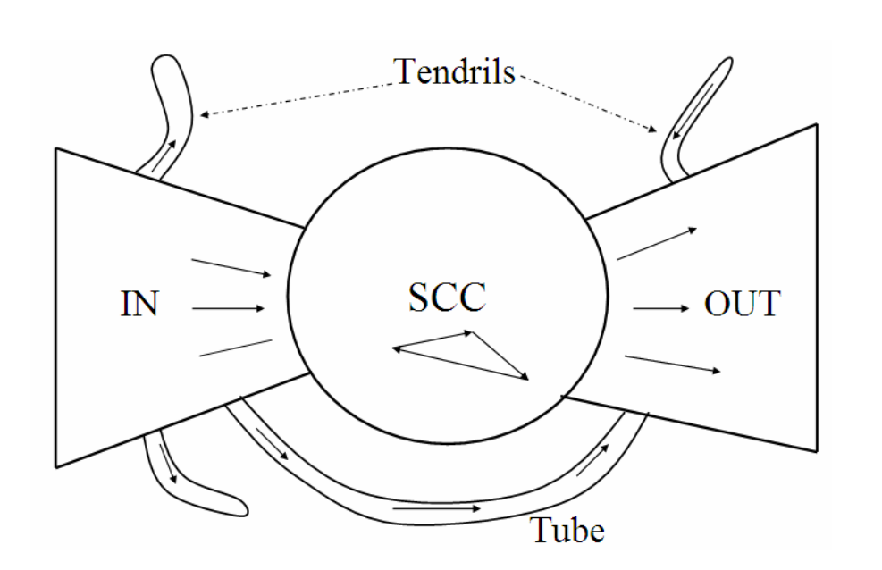

# Web Search

## What are information retrieval, transactional and navigational information needs?

-   There appear to be three broad categories into which common web search queries can be grouped: (i) informational, (ii) navigational and (iii) transactional. We now explain these categories; it should be clear that some queries will fall in more than one of these categories, while others will fall outside them
-   Informational queries seek general information on a broad topic, such as leukemia or Provence. There is typically not a single web page that contains all the information sought; indeed, users with informational queries typically try to assimilate information from multiple web pages.
-   Navigational queries seek the website or home page of a single entity that the user has in mind, say Lufthansa airlines. In such cases, the user’s expectation is that the very first search result should be the home page of Lufthansa. The user is not interested in a plethora of documents containing the term Lufthansa; for such a user, the best measure of user satisfaction is precision at 1
-   A transactional query is one that is a prelude to the user performing a trans action on the Web – such as purchasing a product, downloading a file or making a reservation. In such cases, the search engine should return results listing services that provide form interfaces for such transactions

## Name some differences between web search and enterprise search

-   In enterprise search, the search engine users are professionals who know how to make the queries the best way
-   Web search users are not trained on how to write queries or the search operators offered by search engines

## How do you index images?

-   Concept-based image indexing, also variably named as "description-based" or "text-based" image indexing/retrieval, refers to retrieval from text-based indexing of images that may employ keywords, subject headings, captions, or natural language text

## Give examples of ranking signals used by search engines

-   Hundreds of signals are used by search engines to estimate quality
-   Signals can be groups in different dimensions:
    -   Query-independent signals (static).
    -   Query-dependent signals (dynamic)
    -   Document-based signals (content or structural), e.g. HTML.
    -   Collection-based signals, e.g. Links
    -   User-based signals, e.g. Clicks.

## What are the SCC, IN and OUT components in the view of the web as a bowtie?

-   Furthermore, several studies have suggested that the directed graph connecting web pages has a bowtie shape: there are three major categories of web pages that are sometimes referred to as IN, OUT and SCC. A web surfer can pass from any page in IN to any page in SCC, by following hyperlinks. Likewise, a surfer can pass from page in SCC to any page in OUT. Finally, the surfer can surf from any page in SCC to any other page in SCC. However, it is not possible to pass from a page in SCC to any page in IN, or from a page in OUT to a page in SCC (or, consequently, IN).
-   Notably, in several studies IN and OUT are roughly equal in size, whereas SCC is somewhat larger; most web pages fall into one of these three sets. The remaining pages form into tubes that are small sets of pages outside SCC that lead directly from IN to OUT, and tendrils that either lead nowhere from IN, or from nowhere to OUT. The following figure illustrates this structure of the web:
    -   
